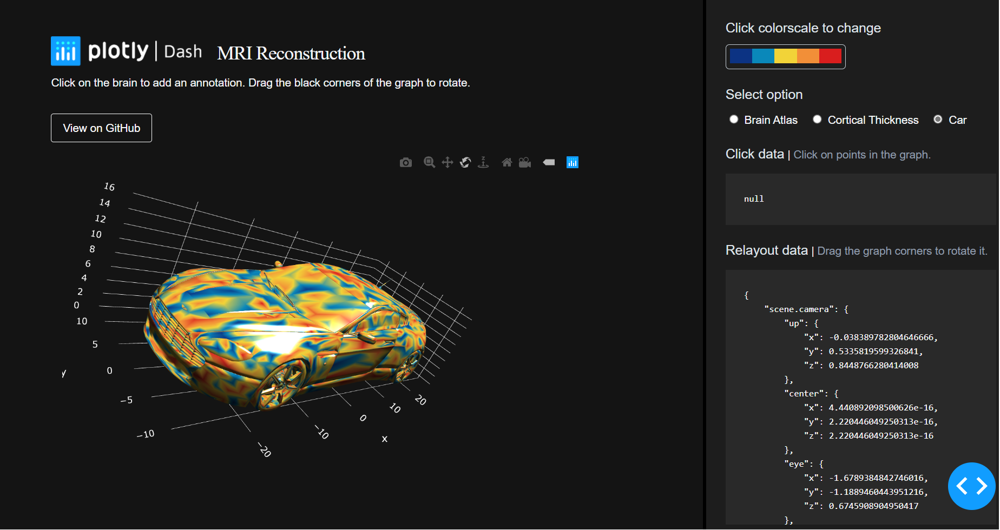

### ДЗ по ТММ (Технология мультимедиа)
#### Вариант 2

#### Задание: 
Синтез 3D изображения цветного автомобиля с использованием dash библиотеки python.

Для проекта были использован данный репозиторий: [plotly/dash-brain-surface-viewer](https://github.com/plotly/dash-brain-surface-viewer)

## Как запустить это приложение

Следующие инструкции относятся к Posix/bash. Пользователи Windows должны проверить
[здесь](https://docs.python.org/3/library/venv.html)

Сначала клонируйте этот репозиторий и откройте терминал в корневой папке.
Создание и активация новой виртуальной среды (рекомендуется) путем запуска
следующее:
```bash
python3 -m venv myvenv
source myvenv/bin/activate
```
Установите требования:
```bash
pip install -r requirements.txt
```
Запустите приложение:
```bash
python app.py
```
Откройте браузер по адресу http://127.0.0.1:8050  

## Снимки экрана  

  
 
### Материалы
- [ACE Lab](https://www.mcgill.ca/bic/research/ace-lab-evans) в McGill для данных мозга и вдохновения от их превосходного мозга [Surface Viewer](https://brainbrowser.cbrain.mcgill.ca/surface-viewer#ct)   
- [Джулия Хунтенбург](https://github.com/juhuntenburg) за выяснение того, как [читать объекты MNI в Python](https://github.com/juhuntenburg/laminar_python/blob/master/io_mesh.py)  
- [Е. Петрисор](https://github.com/empet) за её обширные [исследования в Питоне с сетками Плотлы.js](https://plot.ly/~empet/14767/mesh3d-from-a-stl-file/)  
-------------------------------------------------------------

### TMM DZ (Multimedia Technology)  
#### Variant 2  

#### Job:  
Synthesis of 3D images of a color car using the dash library python.  

This repository was used for the project: [plotly/dash-brain-surface-viewer](https://github.com/plotly/dash-brain-surface-viewer)  

## How to run this app

The following instructions apply to Posix/bash. Windows users should check
[here](https://docs.python.org/3/library/venv.html)  

First, clone this repository and open a terminal inside the root folder.

Create and activate a new virtual environment (recommended) by running
the following:

```bash
python3 -m venv myvenv
source myvenv/bin/activate
```

Install the requirements:

```bash
pip install -r requirements.txt
```
Run the app:

```bash
python app.py
```
Open a browser at http://127.0.0.1:8050

## Screenshots


### Credit

- [ACE Lab](https://www.mcgill.ca/bic/research/ace-lab-evans) at McGill for the brain data and inspiration from their excellent brain [Surface Viewer](https://brainbrowser.cbrain.mcgill.ca/surface-viewer#ct)
- [Julia Huntenburg](https://github.com/juhuntenburg) for figuring out how to [read MNI objects in Python](https://github.com/juhuntenburg/laminar_python/blob/master/io_mesh.py)
- [E. Petrisor](https://github.com/empet) for her extensive [exploration in Python with Plotly.js meshes](https://plot.ly/~empet/14767/mesh3d-from-a-stl-file/)

